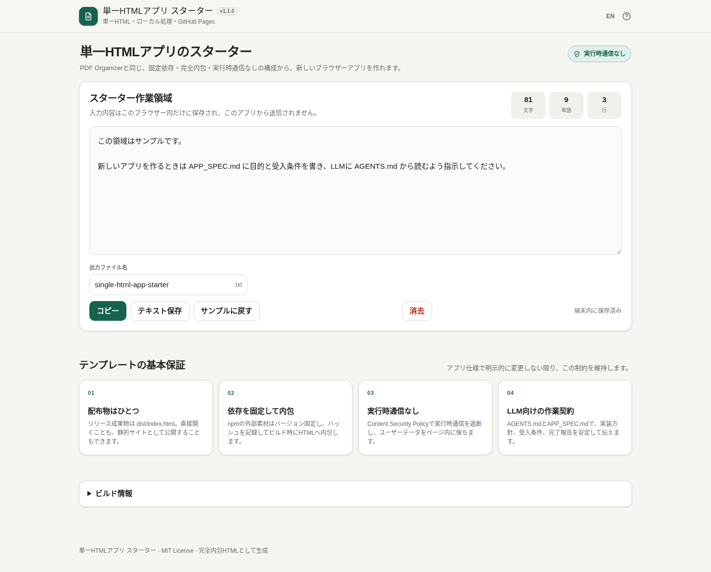

# Single HTML App Template

[](https://github.com/ttomohisa/htmlapps-template/actions/workflows/deploy-pages.yml)
[](LICENSE)
[](https://ttomohisa.github.io/htmlapps-template/)

[日本語 README](README.ja.md)

A GitHub repository template for humans and coding LLMs that repeatedly create **browser applications distributed as one self-contained HTML file**.

It generalizes the approach used by PDF Organizer: develop from readable source, pin external libraries, embed workers/WASM/fonts/support assets at build time, verify the output, and publish the generated single HTML through GitHub Pages.



## Highlights

- Generate both `dist/index.html` and the gzip self-extracting `dist/index.self-extract.html`
- Double-click `build-standalone.bat` on Windows
- No Python or Node.js required
- Exact npm versions with only explicitly selected files embedded as Base64
- SHA-256 records for package tarballs and every embedded file
- No runtime CDN, remote font, API, analytics, or telemetry
- Content Security Policy with `connect-src 'none'`
- GitHub Actions for pull request validation and GitHub Pages deployment
- Starter implementation for bilingual UI, a light-only interface, responsive layout, and keyboard access
- Reusable confirmation dialog: centered modal on desktop and safe-area-aware bottom sheet on smartphones
- `AGENTS.md`, `APP_SPEC.md`, and a reusable LLM request included

## Read these first

| File | Purpose |
| --- | --- |
| `AGENTS.md` | The implementation contract an LLM reads first |
| `APP_SPEC.md` | Product behavior and acceptance criteria |
| `app.config.json` | Application name, slug, version, and description |
| `dependencies.json` | npm packages and files to embed |
| `src/index.template.html` | Editable application source |
| `components/confirm-dialog.html` | Reusable confirmation UI for delete, clear-all, and similar actions |
| `build-standalone.ps1` | Standalone and self-extracting HTML builder |
| `scripts/build-self-extract.ps1` | Gzip and wrap the normal HTML in a self-extracting loader |
| `docs/LLM_WORKFLOW.md` | Recommended LLM workflow and request |

## Create a new app

1. Enable this repository as a GitHub template.
2. Create a new repository with **Use this template**.
3. Rewrite `APP_SPEC.md` with the concrete product.
4. Update `app.config.json`.
5. Inspect `components/` and reuse generic UI pieces where appropriate.
6. Tell the coding LLM to begin with `AGENTS.md`.
7. After implementation, run `build-standalone.bat` on Windows.
8. Open both `dist/index.html` and `dist/index.self-extract.html` directly and test the main flow with the network disabled.

A ready-to-use request is in [LLM Workflow](docs/LLM_WORKFLOW.md).

## Local build

Double-click `build-standalone.bat` on Windows 10/11, or run:

```text
build-standalone.bat
```

Discard the package cache and fetch pinned packages again:

```text
build-standalone.bat -ForceDownload
```

Generated output:

```text
dist/
├─ index.html
├─ index.self-extract.html
├─ dependency-manifest.json
├─ self-extract-manifest.json
└─ .nojekyll
```

`dist/index.html` and `dist/index.self-extract.html` are generated. Edit `src/index.template.html` and rebuild instead of modifying either output directly.

## Embed a third-party library

Add exact package versions and required files to `dependencies.json`. The starter has no dependencies, so its first build can finish without network access.

See `examples/dependencies.dayjs.json` and [Adding Embedded Dependencies](docs/DEPENDENCIES.md).

The builder downloads the package tarball from the official npm registry and embeds only the listed files. The generated application does not contact a CDN at runtime.

## Self-extracting HTML

A normal build creates two variants:

- `dist/index.html`: readable and suitable for debugging, SEO, and the default GitHub Pages entry point
- `dist/index.self-extract.html`: the original HTML is gzip-compressed and restored in the browser with `DecompressionStream`

The self-extracting variant stays offline and dependency-free, but it requires JavaScript and a browser with `DecompressionStream`. Keep the normal HTML as the GitHub Pages entry point; treat the self-extracting file as an optional download artifact for size-constrained distribution.

The loader wrapper is intentionally ASCII-only so it is safe when built with Windows PowerShell 5.1 from a BOM-less UTF-8 repository. Japanese loader text is emitted with ASCII-safe character references / Unicode escapes, and the wrapper automatically inherits the embedded favicon from `dist/index.html`. The verifier rejects encoding regressions, a missing or different favicon, and any gzip payload that does not restore byte-for-byte to the readable HTML.

To skip it:

```powershell
.\build-standalone.ps1 -SkipSelfExtract
```

## GitHub Pages

After creating a new repository, first open **Settings → Pages → Build and deployment → Source** and select **GitHub Actions**. This is a one-time setting for each repository.

`.github/workflows/deploy-pages.yml` runs on every push to `main`:

1. Build the standalone HTML on a Windows runner.
2. Reject external runtime references and unresolved placeholders.
3. Publish `dist` when GitHub Pages is enabled.
4. Skip only the deployment and show setup instructions in the Actions summary when Pages is not configured yet.

After enabling Pages, open Actions and choose **Re-run all jobs**. The generated standalone HTML is still saved as a normal Actions artifact when Pages is not yet enabled.

## Repository layout

```text
.
├─ AGENTS.md
├─ APP_SPEC.md
├─ app.config.json
├─ dependencies.json
├─ components/
│  └─ confirm-dialog.html
├─ src/
│  └─ index.template.html
├─ scripts/
│  ├─ build-self-extract.ps1
│  ├─ check-repository.ps1
│  ├─ verify-self-extract.ps1
│  └─ verify-standalone.ps1
├─ docs/
├─ examples/
├─ dist/
├─ build-standalone.bat
├─ build-standalone.ps1
└─ .github/workflows/
```

## Reusable UI components

`components/` contains dependency-free source snippets that can be copied into finished apps. The first standard component is `confirm-dialog.html`, intended for deletion, clear-all, overwrite, and similar confirmation flows. The starter's Clear action uses the same `AppConfirm.ask()` pattern.

It renders as a centered modal on desktop and a safe-area-aware bottom sheet on smartphones. See [Reusable UI components](docs/COMPONENTS.md) for usage.

## Security and privacy

The starter CSP blocks runtime network connections. A GitHub Pages deployment needs one initial HTML request, but application processing then stays inside the page. For a fully disconnected session, open the generated `dist/index.html` or `dist/index.self-extract.html` locally.

Static checks are guardrails rather than proof. Before publishing, also inspect the browser network panel.

## License

Copyright © 2026 ttomohisa

Released under the [MIT License](LICENSE). Update authorship and third-party notices appropriately in applications created from this template.

- A standard upper-right “How to use & notes” dialog
